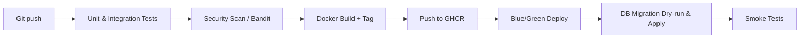

# 📐 System Architecture Overview

> **Purpose**: Give new engineers or assistants a bird’s‑eye view of how our backend system is structured and how requests flow end‑to‑end.

---

## 1. High‑Level Stack

| Layer                    | Technology                                 | Notes                                                  |
| ------------------------ | ------------------------------------------ | ------------------------------------------------------ |
| Frontend                 | **React 18** + Vite + TypeScript + MUI     | SPA for web‑admin; future mobile app consumes same API |
| API Gateway / Web Server | **Nginx**                                  | TLS termination, rate limit, static assets             |
| Application Server       | **Django 4.2** + **Django REST Framework** | Deployed with Gunicorn inside Docker                   |
| Background Jobs          | **Celery** (Redis broker)                  | Long‑running tasks, report refresh, email              |
| Cache / Message Broker   | **Redis**                                  | Caching hot queries + Celery broker                    |
| Database                 | **PostgreSQL 15** (multi‑schema)           | AUTH, AGENCY, INVENTORY, FINANCE, CONFIG               |
| Observability            | Prometheus + Grafana + Loki                | Metrics, logs, alerts                                  |
| CI/CD                    | GitHub Actions → Docker Registry → Server  | Blue/Green deploy, migration dry‑run                   |

> **Hosting**: Docker Compose on a single VM in staging; target K8s (k3s) for production.

---

## 2. Modular‑Monolith Structure

```
backend/
├── apps/
│   ├── auth/             # JWT, RBAC, user, role, permission
│   ├── agency/           # Đại lý, loại đại lý, công nợ
│   ├── inventory/        # Vật tư, phiếu nhập / xuất, tồn kho
│   ├── finance/          # Giao dịch nợ, thanh toán
│   ├── report/           # Báo cáo định kỳ, materialized views
│   └── regulation/       # Quy định hệ thống & feature flags
├── core/                 # Settings, middleware, utils
└── manage.py
```

*Each **********app********** is a **********bounded context********** in Domain‑Driven Design; code can later be carved out into micro‑services without breaking contracts.*

---

## 3. Data Flow 🚚  (Example: "Xuất hàng")

1. **Frontend** (§`/phieu-xuat/new`) sends `POST /api/v1/inventory/issues/` with line items.
2. **DRF ViewSet** validates request → calls **IssueService.create()** inside a DB transaction.
3. **IssueService**

   * Inserts **inventory.issue** row (`idNguoiLap = current_user`).
   * Bulk‑creates **inventory.issue\_detail** rows.
   * Invokes **domain rule**: check agency debt limit; raises exception if exceeded.
   * Lowers `stock_quantity` via SQL function `f_reduce_stock_on_issue`.
4. **Celery task** `notify_issue_created` pushes real‑time notification + schedules nightly stock report refresh.
5. API returns **201 Created** → Frontend shows success toast, updates React Query cache.

---

## 4. Database Design Highlights

* **Multi‑schema**: logical isolation (`auth.*`, `inventory.*`, `finance.*` …).
* **INT PK** today; switchable to **UUID**.
* **Triggers** enforce totals, stock changes, and debt update.
* **Materialized views** (report schema) refreshed by Celery.
* **Row‑Level Security** guards data by agency; middleware sets `SET app.current_user_id`.
* Key indices:

  * `GIN (item_name gin_trgm_ops)` for fuzzy search.
  * `BRIN (payment_date)` for large payment table.

---

## 5. Security Model 🔐

* **JWT** access/refresh tokens, stored in HttpOnly cookie.
* **RBAC** scopes: `agency:read`, `inventory:write`, `report:read`, …
* **2FA** for admin via TOTP.
* **CSP**, **HSTS**, **SameSite=strict** cookies.
* Automated **OWASP ZAP** scan on every release.

---

## 6. Observability & Ops

* **Structured JSON logs** → Loki → Grafana.
* **Prometheus** scrapes Gunicorn, Celery, Postgres (`pg_exporter`).
* Alerts to Slack when p95 latency > 500 ms or Celery queue length > 100.
* Daily **pg\_dump** logical backups + WAL archiving via WAL‑G.

---

## 7. CI/CD Pipeline ⏩



*Failed stage = auto‑rollback; coverage gate ≥ 80 %.*

---

## 8. Future Scalability Roadmap

| Phase       | Target                                    | Notes                      |
| ----------- | ----------------------------------------- | -------------------------- |
| **2025 Q3** | Move cache + Celery to dedicated node     | Reduce I/O contention      |
| **2025 Q4** | k3s cluster + HorizontalPodAutoscaler     | CPU‑bound scale            |
| **2026 Q1** | Split `inventory` into standalone service | Align with business growth |

---

## 9. Contact Points

* **Tech Lead**: Nguyen Ba Long
* **DevOps**: Tran Nguyen Duc Trung *(@devops.b)*
* **Product Owner**: Nguyen Ba Long 😉 – iterate via GitHub issues under `architecture` label.

---

> **Last updated**: 2025‑06‑21
