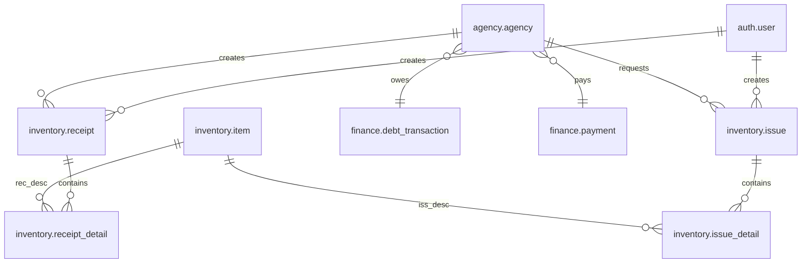

# 🗄️ Comprehensive Database Overview

> **Scope**: Provide a single, self‑contained reference of the relational model that powers the project—covering schemas, tables, relationships, constraints, triggers, indexes, RLS, and operational routines. Geared toward DBAs, backend developers, and data analysts.

---

## 1. Schema Topology

| Schema        | Purpose                           | Key Entities                                                 |
| ------------- | --------------------------------- | ------------------------------------------------------------ |
| **auth**      | Identity & RBAC                   | `user`, `role`, `permission`, `user_role`                    |
| **agency**    | Business partners (đại lý)        | `agency`, `agency_type`                                      |
| **inventory** | Stock management                  | `item`, `receipt`, `receipt_detail`, `issue`, `issue_detail` |
| **finance**   | Debt & payments                   | `debt_transaction`, `payment`                                |
| **config**    | System rules & feature flags      | `regulation`, `regulation_history`                           |
| **report**    | Read‑optimised materialised views | `mv_daily_stock`, `mv_sales_by_agency`, `mv_debt_age`        |

> **Note**: Every table name is lowercase, snake\_case, **no Vietnamese accent** to stay ASCII‑friendly and compatible with ORM mapping.

---

## 2. Mermaid ER Diagram (Core Domains)



*(Open canvas, use “Mermaid preview” to visualise relationships)*

---

## 3. Table Catalogue

### 3.1 `auth` Schema

| Table            | Columns (PK **bold**)                                                  | Notes                                                   |
| ---------------- | ---------------------------------------------------------------------- | ------------------------------------------------------- |
| **user**         | **id** SERIAL, email `UNIQUE`, password\_hash, is\_active, created\_at | Uses Django default but mirrored here for raw SQL joins |
| role             | **id**, name `UNIQUE`, description                                     |                                                         |
| permission       | **id**, code `UNIQUE`, description                                     |                                                         |
| user\_role       | **user\_id** FK → user, **role\_id** FK → role                         | composite PK(user\_id, role\_id)                        |
| role\_permission | **role\_id**, **permission\_id**                                       | composite PK(role\_id, permission\_id)                  |

### 3.2 `agency` Schema

| Table        | Columns (PK **bold**)                                                                                                                                       | Business Rules                                     |
| ------------ | ----------------------------------------------------------------------------------------------------------------------------------------------------------- | -------------------------------------------------- |
| agency\_type | **id**, name, max\_debt (CHECK > 0)                                                                                                                         | referenced by agency                               |
| agency       | **id**, code `UNIQUE`, name, type\_id FK→agency\_type, debt\_amount (DEFAULT 0), status ENUM(active,pending,blocked), created\_by FK→auth.user, created\_at | RLS by current\_user agency\_id for data isolation |

### 3.3 `inventory` Schema

| Table           | Columns (PK **bold**)                                                            | Constraints / Indexes                          |
| --------------- | -------------------------------------------------------------------------------- | ---------------------------------------------- |
| item            | **id**, sku `UNIQUE`, item\_name, unit\_price (NUMERIC 12,2 >0), stock\_quantity | `GIN(item_name gin_trgm_ops)` for fuzzy search |
| receipt         | **id**, agency\_id FK, created\_by FK→auth.user, receipt\_date, total\_amount    | trigger fills total\_amount                    |
| receipt\_detail | **id**, receipt\_id FK, item\_id FK, quantity, line\_total                       | trigger computes line\_total                   |
| issue           | **id**, agency\_id FK, created\_by, issue\_date, total\_amount                   | debt check BEFORE INSERT                       |
| issue\_detail   | **id**, issue\_id FK, item\_id FK, quantity, line\_total                         |                                                |

### 3.4 `finance` Schema

| Table             | Columns (PK **bold**)                                                                             | Remarks                                  |
| ----------------- | ------------------------------------------------------------------------------------------------- | ---------------------------------------- |
| debt\_transaction | **id**, agency\_id FK, issue\_id FK NULL, change\_amount (+/-), created\_at                       | Snapshot of debt evolutions              |
| payment           | **id**, agency\_id FK, amount, payment\_method ENUM(cash,bank), payment\_date, ref\_code `UNIQUE` | `BRIN(payment_date)` for fast range scan |

### 3.5 `config` Schema

| Table               | Columns                                                                    | Purpose                       |
| ------------------- | -------------------------------------------------------------------------- | ----------------------------- |
| regulation          | **key** PK, value (jsonb), updated\_at                                     | Live config (e.g., max\_debt) |
| regulation\_history | **id**, key, old\_value, new\_value, changed\_by FK→auth.user, changed\_at | for audit                     |

### 3.6 `report` Schema (Materialised Views)

| View                  | Base Query (simplified)                           | Refresh Interval         |
| --------------------- | ------------------------------------------------- | ------------------------ |
| mv\_daily\_stock      | JOIN item, receipt / issue; compute stock per day | nightly 02:00 via Celery |
| mv\_sales\_by\_agency | SUM(issue.total\_amount) GROUP BY agency, month   | every 30 min             |
| mv\_debt\_age         | aging buckets (0‑30,31‑60,61‑90,>90)              | hourly                   |

---

## 4. Triggers & Stored Functions

| Trigger                            | Timing | Table                     | Function & Logic Summary                                               |
| ---------------------------------- | ------ | ------------------------- | ---------------------------------------------------------------------- |
| `tr_receipt_calc_totals`           | AFTER  | inventory.receipt\_detail | `f_update_receipt_total()` sums line\_total into receipt.total\_amount |
| `tr_issue_check_debt_and_stock`    | BEFORE | inventory.issue           | `f_validate_stock_and_debt()` raises EXCEPTION if constraints fail     |
| `tr_issue_after_insert_debt_log`   | AFTER  | inventory.issue           | Inserts row into finance.debt\_transaction (+ amount)                  |
| `tr_payment_after_insert_debt_log` | AFTER  | finance.payment           | Inserts debt\_transaction (‑ amount) + update agency.debt\_amount      |
| `tr_regulation_history`            | AFTER  | config.regulation         | Insert old/new into regulation\_history                                |

Functions are written in **PL/pgSQL**; source stored under `db/scripts/` and applied via Django migrations (`RunSQL`).

---

## 5. Index & Performance Cheat‑Sheet

| Table.Column(s)                                           | Type  | Reason                        |
| --------------------------------------------------------- | ----- | ----------------------------- |
| inventory.item.item\_name                                 | GIN   | Case‑insensitive search       |
| finance.payment.payment\_date                             | BRIN  | Range queries for reports     |
| inventory.issue (agency\_id, issue\_date DESC)            | BTREE | Filter by agency then date    |
| agency.agency.debt\_amount (partial WHERE debt\_amount>0) | BTREE | Dashboard of agencies in debt |
| receipt\_detail (receipt\_id)                             | BTREE | Join performance              |

> Always validate with `EXPLAIN ANALYZE`; adjust fillfactor when table bloats.

---

## 6. Security Layer

### 6.1 Row‑Level Security

```sql
ALTER TABLE agency.agency ENABLE ROW LEVEL SECURITY;
CREATE POLICY p_agency_self ON agency.agency
    USING (id = current_setting('app.current_agency_id')::int);
```

Middleware sets `SET app.current_agency_id = :agency_id` for every request after JWT verification.

### 6.2 Audit Trail

* All `AFTER UPDATE` triggers write old/new rows (as JSONB) into `audit.change_log`.
* `pgcrypto.gen_random_uuid()` provides immutable `event_id` for correlation.

---

## 7. Migration & Seed Strategy

1. **Initial schema** shipped as SQL dump (`001_initial.sql`).
2. Subsequent changes authored via Django migrations (auto + handcrafted `RunSQL`).
3. **Seed fixtures** (`fixtures/dev_seed.json`) limited to \~1 000 rows to keep CI fast.
4. CI pipeline executes `python manage.py migrate --plan` (dry‑run) before apply.

---

## 8. Backup & Restore

| Tier          | Tool / Command                                  | Frequency |
| ------------- | ----------------------------------------------- | --------- |
| Logical dump  | `pg_dump -Fc --exclude-schema=report --jobs=4`  | nightly   |
| WAL archiving | `wal-g backup-push /var/lib/postgresql/15/main` | 15 min    |
| Full physical | `pg_basebackup -Ft -z`                          | weekly    |

Restore documented in runbook `RUNBOOK_DB_RESTORE.md` (blue‑green strategy).

---

## 9. Example Query Recipes

```sql
-- Top 10 agencies by outstanding debt
SELECT a.name, a.debt_amount
FROM agency.agency a
WHERE a.debt_amount > 0
ORDER BY a.debt_amount DESC
LIMIT 10;

-- Stock level of critical items (< 10)
SELECT item_name, stock_quantity
FROM inventory.item
WHERE stock_quantity < 10;

-- Monthly sales summary (last 6 months)
SELECT date_trunc('month', issue_date) AS month,
       SUM(total_amount)               AS revenue
FROM inventory.issue
GROUP BY month
ORDER BY month DESC
LIMIT 6;
```

---

## 10. Glossary

* **MV** – Materialized View (snapshot table, needs refresh)
* **BRIN** – Block Range Index, compact for time‑series
* **RLS** – Row‑Level Security, postgres feature to filter rows per user

---

> **Last updated**: 2025‑06‑21
