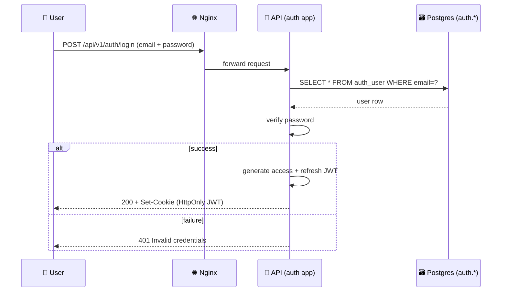
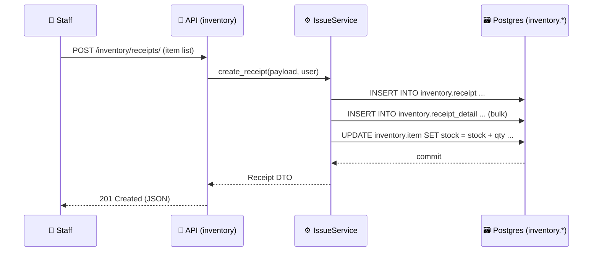
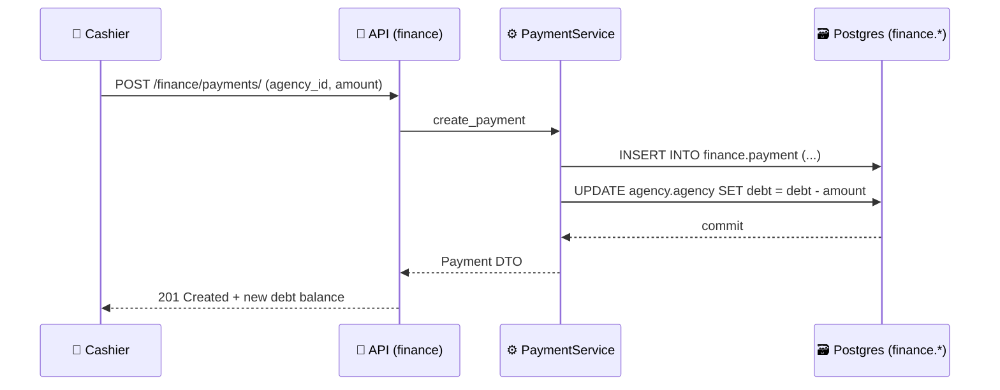

# 🔄 Functional Flow Guide

> **Goal**: Describe, step‑by‑step, how each core feature of the system works from the moment a user triggers an action until the data is persisted (and, if needed, reported back). This helps new teammates debug, extend or test any business flow without reading the full codebase.

---

## Legend

| Symbol | Layer                                 |
| ------ | ------------------------------------- |
| 👤     | End user / Frontend (React SPA)       |
| 🌐     | API Gateway (Nginx)                   |
| 🐍     | Django + DRF application server       |
| ⚙️     | Domain Service (application logic)    |
| 🗃️    | PostgreSQL (multi‑schema)             |
| 📨     | Celery worker (background task)       |
| 🔔     | Notification service / WebSocket push |

---

## 1. Authentication & Session Refresh

*Refresh* token hits `/api/v1/auth/refresh/` → same flow but only verifies refresh JWT and issues a new access JWT.

---

## 2. Agency Lifecycle

### 2.1 Register ➜ Approve ➜ Operate

1. **👤 Agency Admin** fills registration form (company data, contacts).
2. Frontend sends `POST /api/v1/agency/`.
3. **⚙️ AgencyService.create()** validates + inserts into `agency.agency` (status = `PENDING`).
4. **📨 Celery** task `notify_new_agency` emails internal reviewers.
5. **👤 Internal Reviewer** clicks “Approve” in back‑office.
6. API `POST /agency/{id}/approve/` → **AgencyService.approve()** updates status, sets `approved_at`, creates initial debt row (`finance.debt` = 0).
7. WebSocket push 🔔 notifies agency of activation.

---

## 3. Inventory Flows

### 3.1 Stock‑In (Phiếu nhập)

**Business Rules**

* Price & quantity must be positive (DB CHECK).
* Trigger `f_update_total_amount` computes `receipt.total_amount`.

### 3.2 Stock‑Out (Phiếu xuất) & Debt Enforcement

1. Frontend sends `POST /inventory/issues/`.
2. **IssueService** checks current **stock ≥ requested qty** and **debt ≤ max\_debt**.
3. Upon success: inserts issue rows, decrements stock, increments agency debt via trigger `f_update_debt_amount`.
4. If rule violated, raises `HTTP 409` with structured error `{code: "DEBT_LIMIT", max: 50_000_000, current: 49_900_000}`.

---

## 4. Finance Flows

### 4.1 Debt Payment

**Edge case**: If `amount > debt`, service flips to *credit* and stores negative debt, flagged for accountant.

---

## 5. Reports & Analytics

| Report              | Source Tables                        | Refresh Strategy                                    |
| ------------------- | ------------------------------------ | --------------------------------------------------- |
| **Daily Stock**     | `inventory.item`, `issue`, `receipt` | Materialized view, **Celery** refresh nightly 02:00 |
| **Sales by Agency** | `inventory.issue`                    | Materialized view, refresh every 30 min             |
| **Debt Aging**      | `finance.payment`, `agency.agency`   | Real‑time query (index on `due_date`)               |

> CLI: `python manage.py refresh_mv "sales_by_agency"` for manual refresh.

---

## 6. Regulation Update Flow

1. **Admin** edits regulation (e.g., `max_debt`) in settings UI.
2. Frontend calls `PUT /regulation/max_debt`.
3. **RegulationService.update()** writes new value to `config.regulation` and triggers **Redis pub/sub** event `REGULATION_UPDATED`.
4. In‑memory cache inside **IssueService** auto‑refreshes via listener – no restart required.

---

## 7. Error Handling & Notification

| Error Code      | Scenario                                    | Client Action                                        |
| --------------- | ------------------------------------------- | ---------------------------------------------------- |
| `DEBT_LIMIT`    | Agency debt would exceed limit on stock‑out | Show modal advising payment before further stock‑out |
| `OUT_OF_STOCK`  | Item quantity insufficient                  | Disable “Confirm” button, suggest backorder          |
| `INVALID_TOKEN` | Access JWT expired                          | Call refresh endpoint, retry request                 |

System also emits **structured JSON logs** with `trace_id`, allowing correlating frontend error toast ↔ Grafana log line.

---

## 8. Background & Scheduled Jobs

| Schedule      | Task                    | Purpose                                  |
| ------------- | ----------------------- | ---------------------------------------- |
| `*/5 * * * *` | `recalc_agency_ranking` | Re‑score agencies for leaderboard widget |
| `02:00` daily | `refresh_mv_stock`      | Refresh stock materialized view          |
| `03:00` daily | `pg_dump + WAL‑G`       | Incremental DB backup                    |

Celery has **High‑, Medium‑, Low‑priority** queues. Heavy reports go to *low* to avoid blocking real‑time email tasks.

---

## 9. Sequence Reference Cheatsheet

* **Login** → */auth/login* → JWT cookies
* **Create Receipt** → */inventory/receipts/* → triggers stock +
* **Create Issue** → */inventory/issues/* → triggers stock − & debt +
* **Pay Debt** → */finance/payments/* → debt −
* **Get Daily Stock** → \_/report/stock/daily?*date=2025‑06‑20*

---

> **Last updated**: 2025‑06‑21
